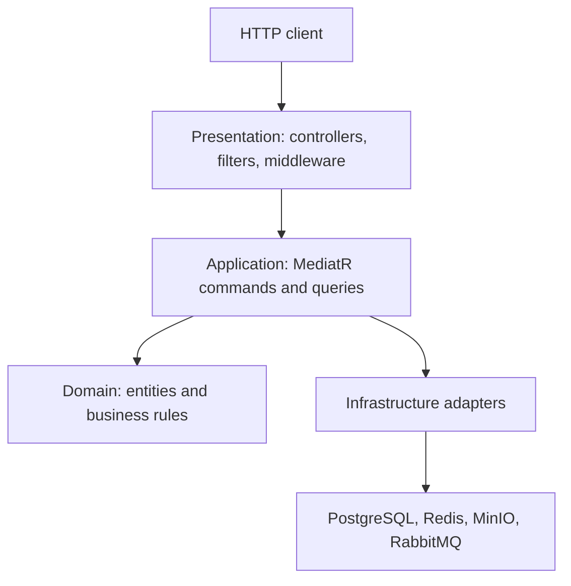

# Warehouse Management API

This document is an API README and reference generated from the current Warehouse API implementation. It documents only routes, contracts, validation, and behavior present in the source code.

## 1. API README

### Overview

The Warehouse Management API is an ASP.NET Core 8 REST API for managing:

- Products, stock levels, prices, suppliers, and product expiry dates.
- Product images stored outside the database.
- Suppliers and supplier PDF documents.
- Inventory dashboard counts.
- Firebase-authenticated user information.
- Validation metadata and localized messages.

The API uses CQRS-style request handlers through MediatR. PostgreSQL stores business data, Redis caches selected product queries, MinIO stores uploaded files, RabbitMQ publishes warehouse events, and Hangfire runs the product-expiry background job.

This document covers `Warehouse.Presentation`, the main Warehouse API. The repository also contains a separate `Warehouse.Notifications.sln`; that service is discussed in the architecture notes but its HTTP API is outside this document's endpoint scope.

### Project structure

| Project | Responsibility |
| --- | --- |
| `Warehouse.Domain` | Entities, repository interfaces, and domain business rules. |
| `Warehouse.Application` | MediatR commands and queries, DTOs/view models, validation, caching keys, events, and background-job logic. |
| `Warehouse.Infrastructure` | EF Core repositories, PostgreSQL access, Redis cache adapter, MinIO storage, and RabbitMQ publisher. |
| `Warehouse.Presentation` | Controllers, authentication/authorization, middleware, filters, health checks, Swagger, and dependency registration. |
| `tests/Warehouse.Api.UnitTests` | Unit-test project. |
| `tests/Warehouse.Api.IntegrationTests` | Integration-test project. |

### Runtime requirements

- .NET 8 SDK.
- PostgreSQL.
- Redis.
- MinIO with an existing configured bucket.
- RabbitMQ.
- A Firebase project for JWT validation.

The application reads the following configuration keys:

| Configuration key | Used for |
| --- | --- |
| `ConnectionStrings:DefaultConnection` | EF Core, PostgreSQL health check, and Hangfire storage. |
| `ConnectionStrings:Redis` | Distributed product cache. |
| `Firebase:ProjectId` | Firebase token issuer and audience validation. Startup fails if it is absent. |
| `Minio:Endpoint` | MinIO endpoint and MinIO health check. |
| `Minio:AccessKey` | MinIO authentication. |
| `Minio:SecretKey` | MinIO authentication. |
| `Minio:BucketName` | Object-storage bucket. |
| `Minio:UseSSL` | Whether the MinIO client and health check use HTTPS. |
| `RabbitMq:HostName` | RabbitMQ host. |
| `RabbitMq:Port` | RabbitMQ port. Startup fails when it is missing or invalid. |
| `RabbitMq:UserName` | RabbitMQ authentication. |
| `RabbitMq:Password` | RabbitMQ authentication. |
| `RabbitMq:ExchangeName` | Topic exchange used for warehouse events. |
| `LowStock:Threshold` | Threshold used to detect a transition into low stock. |
| `BackgroundJobs:ProductExpirySchedule` | Optional Hangfire cron schedule. The code falls back to `Cron.Daily()`. |

Configuration values can be supplied through the normal ASP.NET Core configuration providers, such as user secrets, environment variables, or an application settings file. Do not commit credentials.

### Build and run

From the repository root:

```bash
dotnet restore WarehouseManagement.sln
dotnet build WarehouseManagement.sln --no-restore
```

Apply the existing EF Core migrations:

```bash
dotnet ef database update \
  --project Warehouse.Infrastructure \
  --startup-project Warehouse.Presentation
```

Run the API:

```bash
dotnet run --project Warehouse.Presentation
```

The base URL is the URL selected by the ASP.NET Core host configuration. The examples below use:

```text
https://localhost:<port>
```

In the Development environment, Swagger UI is available at `/swagger` and the Hangfire dashboard is available at `/hangfire`.

### Run tests

```bash
dotnet test WarehouseManagement.sln --no-restore
```

The unit and integration projects can also be run separately:

```bash
dotnet test tests/Warehouse.Api.UnitTests/Warehouse.Api.UnitTests.csproj --no-restore
dotnet test tests/Warehouse.Api.IntegrationTests/Warehouse.Api.IntegrationTests.csproj --no-restore
```

## 2. Authentication, authorization, and common headers

### Firebase bearer authentication

Protected endpoints expect a Firebase ID token:

```http
Authorization: Bearer <firebase-id-token>
```

The token is validated against the configured Firebase project. The authorization policies use the token's `role` claim:

| Access label in this document | Required identity |
| --- | --- |
| Public | No authentication attribute is applied. |
| Authenticated | Any valid authenticated identity. |
| User/Admin | `role` is `user` or `admin`. |
| Admin | `role` is `admin`. |

An unauthenticated request to a protected route is challenged with `401 Unauthorized`. An authenticated user who does not satisfy the required role policy receives `403 Forbidden`.

### Correlation and timing headers

Clients may send an optional correlation identifier:

```http
X-Correlation-ID: order-import-2026-08-05
```

If it is absent or blank, the API generates a GUID. Responses include:

```http
X-Correlation-ID: order-import-2026-08-05
X-Response-Time-ms: 18
```

The correlation identifier also becomes the trace ID returned by handled application errors and is included in published integration events.

### Localization header

The request-localization configuration supports `en-US` and `fr-FR`:

```http
Accept-Language: fr-FR
```

The server-time endpoint additionally handles `ar-LB` directly when formatting its response. Any other value on that endpoint falls back to `en-US`.

### JSON conventions

Examples use the ASP.NET Core JSON naming convention, so C# properties such as `QuantityInStock` are returned as `quantityInStock`. GUID and timestamp values in the examples are illustrative.

## 3. Common response contracts

### Product

```json
{
  "id": "22222222-2222-2222-2222-222222222222",
  "name": "Gaming Monitor",
  "sku": "MON-001",
  "description": "27-inch gaming monitor",
  "price": 299.99,
  "quantityInStock": 15,
  "supplierName": "Acme Supplies",
  "expiryDate": "2027-08-05T00:00:00Z",
  "isArchived": false,
  "createdAt": "2026-08-05T06:30:00Z",
  "lastUpdatedAt": "2026-08-05T06:30:00Z"
}
```

### Supplier

```json
{
  "id": "11111111-1111-1111-1111-111111111111",
  "name": "Acme Supplies",
  "country": "Lebanon",
  "contactEmail": "sales@acme.example",
  "phoneNumber": "+961-1-555-010",
  "isActive": true
}
```

### File metadata

Product image metadata and supplier document metadata have the same exposed shape:

```json
{
  "id": "33333333-3333-3333-3333-333333333333",
  "fileName": "monitor.jpg"
}
```

The MinIO object key is stored internally as `FilePath` but is not returned by the metadata-list endpoints.

### Temporary file URL

```json
{
  "url": "https://storage.example/presigned-object-url",
  "expiresInSeconds": 1000
}
```

### Structured API error

Exceptions handled by `ExceptionHandlingMiddleware` and model-validation failures use:

```json
{
  "code": "NOT_FOUND",
  "message": "Product was not found.",
  "traceId": "order-import-2026-08-05"
}
```

| HTTP status | `code` | Source |
| --- | --- | --- |
| `400` | `VALIDATION_ERROR` | Data-annotation/model validation or FluentValidation. |
| `400` | `BAD_REQUEST` | `BadRequestException`. |
| `400` | `BUSINESS_RULE_ERROR` | Domain `BusinessRuleException`. |
| `404` | `NOT_FOUND` | `NotFoundException`. |
| `409` | `CONFLICT` | `ConflictException`. |
| `500` | `INTERNAL_SERVER_ERROR` | Any other exception; the public message is generic. |

File-upload checks performed directly inside controllers return `400 Bad Request` with a plain message rather than this structured error contract.

## 4. Endpoint summary

### Products

| Method | Route | Access | Success | Summary |
| --- | --- | --- | --- | --- |
| `GET` | `/api/products` | User/Admin | `200` | List products; optional `onlyAvailable` filter. |
| `GET` | `/api/products/expiring-soon` | User/Admin | `200` | List products expiring from today through the next 30 days. |
| `GET` | `/api/products/{id}` | User/Admin | `200` | Get one product by GUID. |
| `GET` | `/api/products/search` | User/Admin | `200` | Search by product name and/or supplier name. |
| `POST` | `/api/products` | Admin | `201` | Create a product for an existing supplier. |
| `POST` | `/api/products/{id}/quantity` | Admin | `200` | Replace the product's quantity with a raw JSON integer. |
| `POST` | `/api/products/{id}/price` | Admin | `200` | Replace the product's price with a raw JSON number. |
| `DELETE` | `/api/products/{id}` | Admin | `200` | Soft-delete by setting `isArchived` to `true`. |
| `GET` | `/api/products/server-time` | User/Admin | `200` | Return formatted UTC server time. |
| `POST` | `/api/products/{id}/assign-supplier/{supplierId}` | Admin | `200` | Assign an active supplier to a non-archived product. |
| `POST` | `/api/products/{id}/image` | Admin | `200` | Upload a JPEG or PNG image, maximum 5 MiB. |
| `GET` | `/api/products/{id}/images` | User/Admin | `200` | List image metadata for a product ID. |
| `GET` | `/api/products/images/{imageId}/download` | User/Admin | `200` | Download image bytes. |
| `PUT` | `/api/products/images/{imageId}` | Admin | `200` | Replace an image and return a new image ID. |
| `DELETE` | `/api/products/images/{imageId}` | Admin | `200` | Delete image metadata and the stored object. |
| `GET` | `/api/products/images/{imageId}/url` | User/Admin | `200` | Create a temporary image URL valid for 1,000 seconds. |

### Suppliers

| Method | Route | Access | Success | Summary |
| --- | --- | --- | --- | --- |
| `GET` | `/api/suppliers` | User/Admin | `200` | List suppliers. |
| `GET` | `/api/suppliers/{id}` | User/Admin | `200` | Get one supplier by GUID. |
| `POST` | `/api/suppliers` | Admin | `201` | Create a supplier. |
| `DELETE` | `/api/suppliers/{id}` | Admin | `200` | Deactivate a supplier. |
| `POST` | `/api/suppliers/{id}/documents` | Admin | `200` | Upload a PDF document, maximum 10 MiB. |
| `GET` | `/api/suppliers/{id}/documents` | User/Admin | `200` | List document metadata for a supplier ID. |
| `GET` | `/api/suppliers/documents/{documentId}/download` | User/Admin | `200` | Download a PDF. |
| `PUT` | `/api/suppliers/documents/{documentId}` | Admin | `200` | Replace a PDF and return a new document ID. |
| `DELETE` | `/api/suppliers/documents/{documentId}` | Admin | `200` | Delete document metadata and the stored object. |
| `GET` | `/api/suppliers/documents/{documentId}/url` | User/Admin | `200` | Create a temporary document URL valid for 1,000 seconds. |

### Stock, inventory, user, localization, and metadata

| Method | Route | Access | Success | Summary |
| --- | --- | --- | --- | --- |
| `POST` | `/api/stock-adjustments` | Admin | `200` | Apply a stock delta and record a `StockMovement`. |
| `GET` | `/api/inventory/dashboard` | User/Admin | `200` | Return product and supplier counts. |
| `GET` | `/api/auth/current-user` | Authenticated | `200` | Return selected Firebase claims. |
| `GET` | `/api/localization/message` | Public | `200` | Return the localized welcome message. |
| `GET` | `/api/metadata/validation/{dtoName}` | Public | `200` | Return DataAnnotations metadata for a supported request DTO. |

## 5. Detailed requests and responses

The examples below omit repeated response headers and use `<token>` for a Firebase ID token.

### 5.1 Products

#### List products

```http
GET /api/products?onlyAvailable=true HTTP/1.1
Authorization: Bearer <token>
```

`onlyAvailable` defaults to `false`. When it is `true`, only products with `quantityInStock > 0` and `isArchived == false` are returned. With the default value, archived and out-of-stock products are also included.

```http
HTTP/1.1 200 OK
Content-Type: application/json
```

```json
[
  {
    "id": "22222222-2222-2222-2222-222222222222",
    "name": "Gaming Monitor",
    "sku": "MON-001",
    "description": "27-inch gaming monitor",
    "price": 299.99,
    "quantityInStock": 15,
    "supplierName": "Acme Supplies",
    "expiryDate": "2027-08-05T00:00:00Z",
    "isArchived": false,
    "createdAt": "2026-08-05T06:30:00Z",
    "lastUpdatedAt": "2026-08-05T06:30:00Z"
  }
]
```

#### List products expiring soon

```http
GET /api/products/expiring-soon HTTP/1.1
Authorization: Bearer <token>
```

The date window starts at the current UTC date and ends after the date 30 days later, making today through day 30 inclusive eligible. Results are ordered by expiry date, then name. The query does not exclude archived products.

```http
HTTP/1.1 200 OK
Content-Type: application/json
```

```json
[
  {
    "id": "22222222-2222-2222-2222-222222222222",
    "name": "Gaming Monitor",
    "sku": "MON-001",
    "description": "27-inch gaming monitor",
    "price": 299.99,
    "quantityInStock": 15,
    "supplierName": "Acme Supplies",
    "expiryDate": "2026-08-20T00:00:00Z",
    "isArchived": false,
    "createdAt": "2026-08-01T08:00:00Z",
    "lastUpdatedAt": "2026-08-01T08:00:00Z"
  }
]
```

#### Get a product by ID

```http
GET /api/products/22222222-2222-2222-2222-222222222222 HTTP/1.1
Authorization: Bearer <token>
```

```http
HTTP/1.1 200 OK
Content-Type: application/json
```

The response is the Product contract shown in Section 3. An archived product remains retrievable. A missing product returns `404 NOT_FOUND` with the message `Product was not found.`

#### Search products

```http
GET /api/products/search?name=Monitor&supplier=Acme HTTP/1.1
Authorization: Bearer <token>
```

At least one non-blank filter is required. When both are provided, both predicates must match. The implementation uses `Contains` for each supplied filter and does not exclude archived products.

```http
HTTP/1.1 200 OK
Content-Type: application/json
```

```json
[
  {
    "id": "22222222-2222-2222-2222-222222222222",
    "name": "Gaming Monitor",
    "sku": "MON-001",
    "description": "27-inch gaming monitor",
    "price": 299.99,
    "quantityInStock": 15,
    "supplierName": "Acme Supplies",
    "expiryDate": "2027-08-05T00:00:00Z",
    "isArchived": false,
    "createdAt": "2026-08-05T06:30:00Z",
    "lastUpdatedAt": "2026-08-05T06:30:00Z"
  }
]
```

A request with neither filter returns:

```json
{
  "code": "BAD_REQUEST",
  "message": "at least one search filter is required",
  "traceId": "<correlation-id>"
}
```

#### Create a product

```http
POST /api/products HTTP/1.1
Authorization: Bearer <admin-token>
Content-Type: application/json
```

```json
{
  "name": "Gaming Monitor",
  "sku": "MON-001",
  "description": "27-inch gaming monitor",
  "price": 299.99,
  "quantityInStock": 15,
  "supplierName": "Acme Supplies",
  "expiryDate": "2027-08-05T00:00:00Z"
}
```

Validation rules:

- `name`: required, maximum 100 characters.
- `sku`: required, maximum 50 characters.
- `description`: maximum 500 characters.
- `price`: at least `0.01`.
- `quantityInStock`: zero or greater.
- `supplierName`: required, maximum 100 characters.
- `expiryDate`: later than the current UTC date.

The supplier is resolved by name using a case-insensitive equality check. The exact SKU must not already exist.

```http
HTTP/1.1 201 Created
Location: /api/products/22222222-2222-2222-2222-222222222222
Content-Type: application/json
```

The body is the Product contract shown in Section 3. A duplicate SKU returns `409 CONFLICT`; an unknown supplier returns `404 NOT_FOUND`.

#### Update quantity

The request body is a raw JSON integer, not an object:

```http
POST /api/products/22222222-2222-2222-2222-222222222222/quantity HTTP/1.1
Authorization: Bearer <admin-token>
Content-Type: application/json

40
```

```http
HTTP/1.1 200 OK
```

The response body is empty. Quantity must be zero or greater. Missing products return `404`; archived products return `400 BUSINESS_RULE_ERROR`.

If the old quantity is at or above `LowStock:Threshold` and the new quantity is below it, the API publishes a `StockLowDetected` event.

#### Update price

The request body is a raw JSON number:

```http
POST /api/products/22222222-2222-2222-2222-222222222222/price HTTP/1.1
Authorization: Bearer <admin-token>
Content-Type: application/json

349.50
```

```http
HTTP/1.1 200 OK
```

The response body is empty. Price must be at least `0.01`. Missing products return `404`; archived products return `400 BUSINESS_RULE_ERROR`.

#### Archive a product

```http
DELETE /api/products/22222222-2222-2222-2222-222222222222 HTTP/1.1
Authorization: Bearer <admin-token>
```

```http
HTTP/1.1 200 OK
```

The response body is empty. This is a soft delete: the product is retained and `isArchived` becomes `true`. Existing image metadata and image objects are not removed. Calling the operation for an already archived product leaves it archived.

#### Get server time

```http
GET /api/products/server-time HTTP/1.1
Authorization: Bearer <token>
Accept-Language: fr-FR
```

```http
HTTP/1.1 200 OK
Content-Type: application/json
```

```json
{
  "serverTime": "mercredi 5 août 2026 06:30:00"
}
```

The value is the current UTC time formatted with the selected culture's long date/time pattern. The exact text changes on every request.

#### Assign a supplier

```http
POST /api/products/22222222-2222-2222-2222-222222222222/assign-supplier/11111111-1111-1111-1111-111111111111 HTTP/1.1
Authorization: Bearer <admin-token>
```

```http
HTTP/1.1 200 OK
```

The response body is empty. The product must exist and must not be archived. The supplier is queried only after these checks and must exist and be active. Invalid state produces `400 BUSINESS_RULE_ERROR`; missing entities produce `404 NOT_FOUND`.

#### Upload a product image

```http
POST /api/products/22222222-2222-2222-2222-222222222222/image HTTP/1.1
Authorization: Bearer <admin-token>
Content-Type: multipart/form-data; boundary=<boundary>

--<boundary>
Content-Disposition: form-data; name="file"; filename="monitor.jpg"
Content-Type: image/jpeg

<binary image data>
--<boundary>--
```

Equivalent cURL form:

```bash
curl -X POST "$BASE_URL/api/products/22222222-2222-2222-2222-222222222222/image" \
  -H "Authorization: Bearer $TOKEN" \
  -F "file=@monitor.jpg;type=image/jpeg"
```

Accepted content types are exactly `image/jpeg` and `image/png`; the maximum size is 5 MiB. The filename is reduced to its final path component before it is stored as metadata.

```json
{
  "id": "33333333-3333-3333-3333-333333333333",
  "success": true
}
```

A missing product returns `404 NOT_FOUND`. Missing/empty, oversized, or unsupported files return a controller-generated `400` message.

#### List product images

```http
GET /api/products/22222222-2222-2222-2222-222222222222/images HTTP/1.1
Authorization: Bearer <token>
```

```json
[
  {
    "id": "33333333-3333-3333-3333-333333333333",
    "fileName": "monitor.jpg"
  }
]
```

The handler filters image metadata by `productId`. It does not separately verify that the product exists, so an unknown product ID with no associated images returns an empty array.

#### Download a product image

```http
GET /api/products/images/33333333-3333-3333-3333-333333333333/download HTTP/1.1
Authorization: Bearer <token>
```

```http
HTTP/1.1 200 OK
Content-Type: image/jpeg
Content-Disposition: attachment; filename=monitor.jpg

<binary image data>
```

`.png` files are returned as `image/png`; `.jpg` and `.jpeg` files as `image/jpeg`; any other stored extension uses `application/octet-stream`. Unknown image IDs return `404 NOT_FOUND`.

#### Replace a product image

```bash
curl -X PUT "$BASE_URL/api/products/images/33333333-3333-3333-3333-333333333333" \
  -H "Authorization: Bearer $TOKEN" \
  -F "file=@monitor-updated.png;type=image/png"
```

The same 5 MiB and JPEG/PNG restrictions as upload apply.

```json
{
  "id": "55555555-5555-5555-5555-555555555555",
  "success": true
}
```

Replacement creates a new metadata entity and therefore a new ID, then removes the old stored object after the database replacement succeeds.

#### Delete a product image

```http
DELETE /api/products/images/33333333-3333-3333-3333-333333333333 HTTP/1.1
Authorization: Bearer <admin-token>
```

```http
HTTP/1.1 200 OK
```

The response body is empty. The stored object is deleted before its database metadata. An unknown image ID returns `404 NOT_FOUND`.

#### Get a temporary product image URL

```http
GET /api/products/images/33333333-3333-3333-3333-333333333333/url HTTP/1.1
Authorization: Bearer <token>
```

```json
{
  "url": "https://storage.example/presigned-object-url",
  "expiresInSeconds": 1000
}
```

An unknown image ID returns `404 NOT_FOUND`.

### 5.2 Suppliers

#### List suppliers

```http
GET /api/suppliers HTTP/1.1
Authorization: Bearer <token>
```

```json
[
  {
    "id": "11111111-1111-1111-1111-111111111111",
    "name": "Acme Supplies",
    "country": "Lebanon",
    "contactEmail": "sales@acme.example",
    "phoneNumber": "+961-1-555-010",
    "isActive": true
  }
]
```

The list includes active and inactive suppliers.

#### Get a supplier by ID

```http
GET /api/suppliers/11111111-1111-1111-1111-111111111111 HTTP/1.1
Authorization: Bearer <token>
```

```json
{
  "id": "11111111-1111-1111-1111-111111111111",
  "name": "Acme Supplies",
  "country": "Lebanon",
  "contactEmail": "sales@acme.example",
  "phoneNumber": "+961-1-555-010",
  "isActive": true
}
```

Current implementation note: a missing supplier returns `404 NOT_FOUND`, but the current handler message is `Product was not found.`

#### Create a supplier

```http
POST /api/suppliers HTTP/1.1
Authorization: Bearer <admin-token>
Content-Type: application/json
```

```json
{
  "name": "Acme Supplies",
  "country": "Lebanon",
  "contactEmail": "sales@acme.example",
  "phoneNumber": "+961-1-555-010"
}
```

Validation rules:

- `name`: required, maximum 100 characters.
- `country`: required, maximum 50 characters.
- `contactEmail`: required, valid email format, maximum 100 characters.
- `phoneNumber`: required, maximum 50 characters.

```http
HTTP/1.1 201 Created
Location: /api/suppliers/11111111-1111-1111-1111-111111111111
Content-Type: application/json
```

The response is the Supplier contract shown above. A new supplier is active.

#### Deactivate a supplier

```http
DELETE /api/suppliers/11111111-1111-1111-1111-111111111111 HTTP/1.1
Authorization: Bearer <admin-token>
```

```http
HTTP/1.1 200 OK
```

The response body is empty. This operation retains the supplier and sets `isActive` to `false`. Repeating the operation leaves the supplier inactive. A missing supplier returns `404 NOT_FOUND`.

#### Upload a supplier document

```bash
curl -X POST "$BASE_URL/api/suppliers/11111111-1111-1111-1111-111111111111/documents" \
  -H "Authorization: Bearer $TOKEN" \
  -F "file=@contract.pdf;type=application/pdf"
```

The only accepted content type is exactly `application/pdf`; the maximum size is 10 MiB. The filename is reduced to its final path component.

```json
{
  "id": "44444444-4444-4444-4444-444444444444",
  "success": true
}
```

After the object and metadata are stored, the handler publishes a `WarehouseFileUploaded` event. A missing supplier returns `404 NOT_FOUND`; file-validation failures return a controller-generated `400` message.

#### List supplier documents

```http
GET /api/suppliers/11111111-1111-1111-1111-111111111111/documents HTTP/1.1
Authorization: Bearer <token>
```

```json
[
  {
    "id": "44444444-4444-4444-4444-444444444444",
    "fileName": "contract.pdf"
  }
]
```

The handler filters metadata by `supplierId`. It does not separately verify that the supplier exists, so an unknown supplier ID with no documents returns an empty array.

#### Download a supplier document

```http
GET /api/suppliers/documents/44444444-4444-4444-4444-444444444444/download HTTP/1.1
Authorization: Bearer <token>
```

```http
HTTP/1.1 200 OK
Content-Type: application/pdf
Content-Disposition: attachment; filename=contract.pdf

<binary PDF data>
```

An unknown document ID returns `404 NOT_FOUND`.

#### Replace a supplier document

```bash
curl -X PUT "$BASE_URL/api/suppliers/documents/44444444-4444-4444-4444-444444444444" \
  -H "Authorization: Bearer $TOKEN" \
  -F "file=@contract-v2.pdf;type=application/pdf"
```

The same 10 MiB and PDF-only restrictions as upload apply.

```json
{
  "id": "66666666-6666-6666-6666-666666666666",
  "success": true
}
```

Replacement creates a new metadata entity and therefore a new ID, then removes the old stored object after the database replacement succeeds.

#### Delete a supplier document

```http
DELETE /api/suppliers/documents/44444444-4444-4444-4444-444444444444 HTTP/1.1
Authorization: Bearer <admin-token>
```

```http
HTTP/1.1 200 OK
```

The response body is empty. The stored object is deleted before its database metadata. An unknown document ID returns `404 NOT_FOUND`.

#### Get a temporary supplier document URL

```http
GET /api/suppliers/documents/44444444-4444-4444-4444-444444444444/url HTTP/1.1
Authorization: Bearer <token>
```

```json
{
  "url": "https://storage.example/presigned-object-url",
  "expiresInSeconds": 1000
}
```

An unknown document ID returns `404 NOT_FOUND`.

### 5.3 Stock adjustments

```http
POST /api/stock-adjustments HTTP/1.1
Authorization: Bearer <admin-token>
Content-Type: application/json
```

```json
{
  "productId": "22222222-2222-2222-2222-222222222222",
  "quantityChange": -3,
  "reason": "Damaged items"
}
```

Validation and business rules:

- `productId` must not be empty.
- `quantityChange` must not be zero.
- `reason` cannot exceed 200 characters.
- `reason` is required when reducing stock.
- The resulting quantity cannot be negative.
- Archived products cannot be updated.

The current quantity plus `quantityChange` becomes the new quantity. The product update and new `StockMovement` are persisted by one EF Core `SaveChangesAsync` call. The response is the updated Product contract:

```json
{
  "id": "22222222-2222-2222-2222-222222222222",
  "name": "Gaming Monitor",
  "sku": "MON-001",
  "description": "27-inch gaming monitor",
  "price": 299.99,
  "quantityInStock": 12,
  "supplierName": "Acme Supplies",
  "expiryDate": "2027-08-05T00:00:00Z",
  "isArchived": false,
  "createdAt": "2026-08-05T06:30:00Z",
  "lastUpdatedAt": "2026-08-05T07:00:00Z"
}
```

As with direct quantity replacement, crossing from at/above the configured threshold to below it publishes `StockLowDetected`.

### 5.4 Inventory dashboard

```http
GET /api/inventory/dashboard HTTP/1.1
Authorization: Bearer <token>
```

```json
{
  "totalProducts": 10,
  "availableProducts": 7,
  "activeSuppliers": 4
}
```

- `totalProducts` counts every product, including archived products.
- `availableProducts` counts products with positive quantity that are not archived.
- `activeSuppliers` counts suppliers whose `isActive` value is `true`.

Each count is loaded independently. If one repository call fails with a non-cancellation exception, that property is returned as `null` while the handler continues to load the others.

### 5.5 Current user

```http
GET /api/auth/current-user HTTP/1.1
Authorization: Bearer <token>
```

```json
{
  "uid": "firebase-user-id",
  "email": "user@example.com",
  "role": "admin"
}
```

The values come from the `sub`, `email`, and `role` claims. A missing individual claim produces `null` for that field.

### 5.6 Localized message

```http
GET /api/localization/message HTTP/1.1
Accept-Language: en-US
```

```json
{
  "message": "Welcome to the Warehouse Management API."
}
```

The message is read from `SharedResources.WelcomeMessage`; the selected resource depends on the current UI culture.

### 5.7 Validation metadata

Supported `dtoName` values are `CreateProductRequest` and `CreateSupplierRequest`, matched case-insensitively.

```http
GET /api/metadata/validation/CreateProductRequest HTTP/1.1
```

```json
{
  "dtoName": "CreateProductRequest",
  "properties": [
    {
      "propertyName": "Name",
      "propertyType": "String",
      "validationRules": ["Required", "StringLength"]
    },
    {
      "propertyName": "Price",
      "propertyType": "Double",
      "validationRules": ["Range"]
    },
    {
      "propertyName": "ExpiryDate",
      "propertyType": "DateTime",
      "validationRules": ["FutureDate"]
    }
  ]
}
```

The actual response contains an entry for every public property on the selected request type. An unsupported name returns `404 NOT_FOUND` with the localized `DtoNotFound` message.

## 6. Operational endpoints

These routes are registered directly by startup code rather than by API controllers:

| Route | Environment | Description |
| --- | --- | --- |
| `/health` | All | JSON health report for PostgreSQL, Redis, and MinIO. Redis is tried up to three times with a one-second delay between failed attempts. RabbitMQ is not part of this health check. |
| `/health-ui` | All | Health Checks UI page. |
| `/health-ui-api` | All | Backend endpoint used by Health Checks UI. |
| `/swagger` | Development | Swagger UI with Firebase bearer-token support. |
| `/hangfire` | Development | Hangfire dashboard. |

The `/health` response is written by `UIResponseWriter.WriteHealthCheckUIResponse`; its HTTP status reflects the aggregate health-check result.

## 7. Architecture notes

### Request flow and dependency direction



- Controllers construct or accept request DTOs and send them through MediatR.
- Application handlers coordinate repositories, cache, storage, event publishing, mapping, and domain methods.
- Product and supplier state rules are enforced in domain entities. Examples include positive prices, non-negative quantities, inactive-supplier assignment prevention, and archived-product mutation prevention.
- Infrastructure implements the repository and service interfaces defined by the inner layers.

### Persistence

`WarehouseDbContext` exposes:

- `Products`
- `Suppliers`
- `ProductImages`
- `SupplierDocuments`
- `StockMovements`

Product queries eager-load `Supplier` when a `ProductViewModel` needs `supplierName`. Read-only list, search, expiring-soon, and product-image queries use EF Core `AsNoTracking()` in the current implementation.

Database relationships use cascading foreign keys in the migrations. API-level product and supplier deletion does not issue a database delete: products are archived and suppliers are deactivated.

### Product caching

Redis stores JSON for:

- All products: `products:all`.
- Available products: `products:available`.
- A product by ID: `product:{productId}`.

The absolute cache duration is five minutes. Product creation invalidates both list keys. Price, quantity, stock-adjustment, and archive operations invalidate the product-by-ID key and both list keys.

Current implementation note: `AssignSupplierHandler` updates the database but does not invalidate product cache entries. If the affected product or product lists are already cached, the old supplier name can remain visible until the five-minute cache entry expires or another invalidating operation occurs.

### File storage

Uploaded bytes are stored in MinIO while the database stores only metadata and an object key:

- Product image key: `products/{productId}/{generated-guid}{extension}`.
- Supplier document key: `suppliers/{supplierId}/{generated-guid}{extension}`.

Temporary URL endpoints call MinIO's presigned GET operation with a 1,000-second expiry. Download endpoints proxy the complete object through the API as a byte array.

Storage and database changes are sequential rather than one distributed transaction. Upload handlers store the object before metadata. Delete handlers remove the object before metadata. Replace handlers upload the new object, replace metadata in the database, then delete the old object.

### RabbitMQ integration

The publisher lazily creates a RabbitMQ connection and a durable, non-auto-delete topic exchange using the configured exchange name. Published messages are JSON with persistent delivery properties.

The Warehouse API currently publishes:

| Routing key | Event | Trigger |
| --- | --- | --- |
| `stock.low` | `StockLowDetected` | Quantity transitions from at/above `LowStock:Threshold` to below it. |
| `file.uploaded` | `WarehouseFileUploaded` | A supplier PDF object and its metadata have been stored. |

Both event types inherit `WarehouseEvent`, which includes `eventId`, `eventTime`, `correlationId`, `eventType`, `relatedEntityId`, `relatedEntityType`, and `severity`.

The separate Notifications solution owns notification persistence and consumes these events. The Warehouse API awaits event publishing in the relevant request handler; there is no outbox transaction coordinating PostgreSQL writes with RabbitMQ publishing in the current code.

### Background processing

Hangfire registers a recurring job named `product-expiry-check`. The configured cron expression is used when present; otherwise it runs daily.

The job:

1. Loads products expiring on or before 30 days from the current UTC date.
2. Logs expired and soon-to-expire products.
3. Archives products whose expiry date is more than seven days before today.
4. Invalidates affected Redis cache entries.

### Cross-cutting behavior

- `CorrelationIdMiddleware` accepts or generates `X-Correlation-ID` and places it on the response.
- `RequestTimingMiddleware` adds `X-Response-Time-ms` and logs requests taking more than 500 ms.
- `ExceptionHandlingMiddleware` maps known application/domain exceptions to the structured error contract.
- `ModelValidationFilter` creates a structured `VALIDATION_ERROR` response because the framework's automatic invalid-model response is suppressed.
- `ActionLoggingFilter` logs controller action start and completion.
- Serilog writes informational logs to the console and daily rolling files under `Logs/warehouse-log-.txt`.
- HTTPS redirection is enabled.

## 8. Important current behavior

- Product and supplier list endpoints are not paginated.
- `GET /api/products` includes archived products unless `onlyAvailable=true`.
- Product search and expiring-soon queries do not filter archived products.
- Product and supplier deactivation endpoints return `200 OK` with empty bodies even though their MediatR handlers create success response objects.
- Price, quantity, assignment, image deletion, and document deletion also return empty `200 OK` bodies.
- Image and document list endpoints return an empty array when no metadata matches; they do not validate the parent product or supplier first.
- Replacing an image or document returns a new resource ID.
- Controller-level file validation returns plain `400` messages, while exception and model-validation failures use the structured error object.
- RabbitMQ availability is not included in `/health`.
